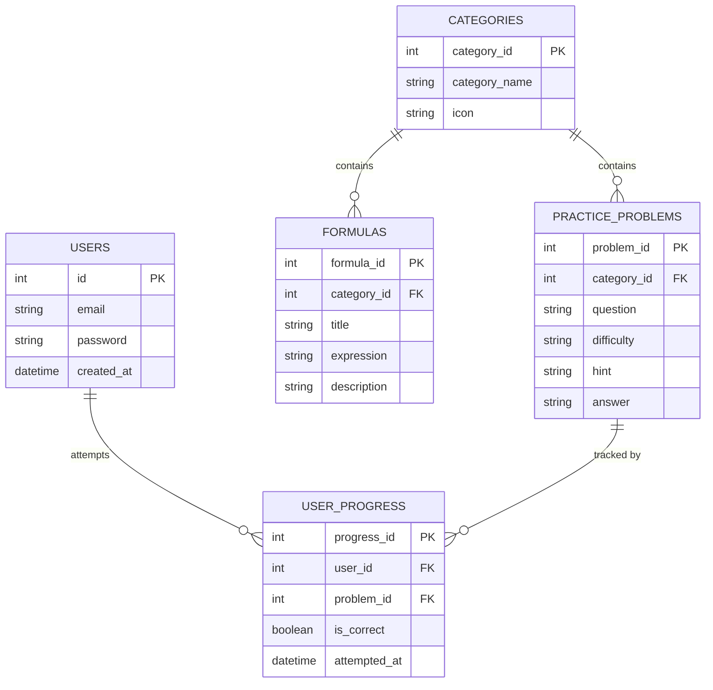

# AxiomMath — Entity-Relationship Diagram

Week 5, Activity 1. Normalized to 3NF: every non-key column depends
on its own primary key only, no transitive dependencies.

## Why this is 3NF

- **1NF** — every column holds a single atomic value (no comma-separated
  lists; `category_name` is one subject, not several).
- **2NF** — every table has a single-column primary key, so there are no
  composite keys and therefore no partial dependencies to remove.
- **3NF** — no non-key column depends on another non-key column. For
  example, `category_name` and `icon` live only in `CATEGORIES`, not
  repeated inside every row of `FORMULAS` — that's exactly the
  transitive dependency the Week 5 lab's patient/doctor example
  warns against.

## Relationships

- One category has many formulas, and many practice problems (`||--o{`)
- One user can attempt many practice problems, tracked in `USER_PROGRESS`
- One practice problem can be attempted by many users
- `USER_PROGRESS` is the junction table resolving that many-to-many
  relationship between `USERS` and `PRACTICE_PROBLEMS`
